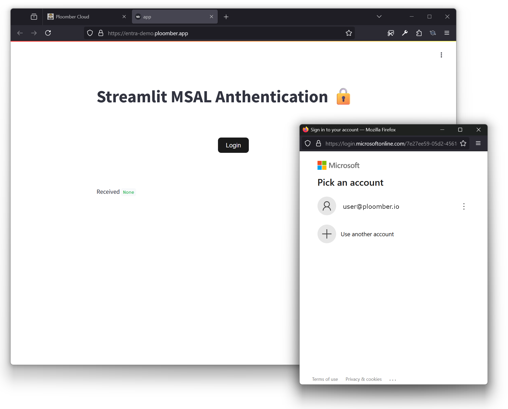
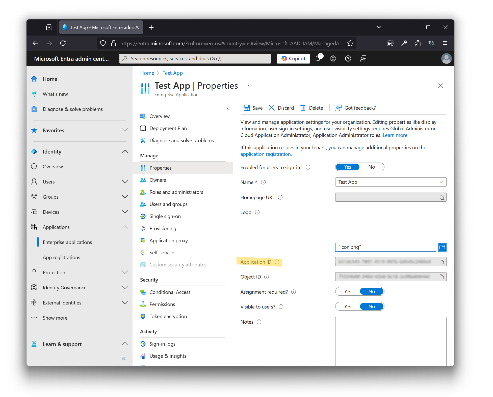
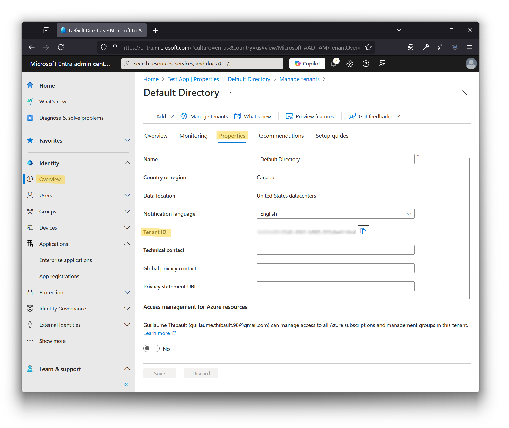

<div align="center">
  <h1 align="center"><b>Streamlit - Microsoft MSAL Authentication</b></h1>
  

  A Streamlit component for Microsoft Authentication Library (MSAL) integration


  [](https://badge.fury.io/py/msal-streamlit-authentication)

  ```sh
  pip install msal-streamlit-authentication
  ```

 [Example: Local Project With Docker](./example/local/) | [Example: Deploy MSAL on Ploomber](./example/ploomber/) | [Enterprise Support](https://calendly.com/edubr/ploomber-customer-support)

 [Deploy Streamlit on Ploomber Cloud for Free](https://www.platform.ploomber.io/register/?utm_medium=github&utm_source=msal)
</div>


## Overview

> [!IMPORTANT]
> 🏢 **Enterprise Support Available**: Looking for advanced features, SLA, or dedicated support?
<b><a href="mailto:support@ploomber.io">Contact our team →</a></b>

This Streamlit component enables seamless client-side authentication using:
- Azure Active Directory (AAD) work and school accounts
- Microsoft personal accounts (MSA)
- Social identity providers (Facebook, Google, LinkedIn, etc.) through Azure AD B2C

Built on the [Microsoft MSAL JS Library](https://github.com/AzureAD/microsoft-authentication-library-for-js/tree/dev/lib/msal-browser), it supports any provider using OpenID Connect Authorization Code Flow (PKCE).

<div align="center">
  
</div>

## Quick Start

1. **Register Your Application**
   - [Register a Single Page Application in Azure AD](https://docs.microsoft.com/en-us/azure/active-directory/develop/scenario-spa-app-registration)
   - Note your Client ID and configure redirect URIs for targeted final URI

2. **Install the Package**
   ```sh
   pip install msal-streamlit-authentication
   ```

3. **Implementation Example**
   ```python
   value = msal_authentication(
       auth={
           "clientId": "YOUR_CLIENT_ID",
           "authority": "https://login.microsoftonline.com/YOUR_TENANT_ID",
           "redirectUri": "/",
           "postLogoutRedirectUri": "/"
       },
       cache={
           "cacheLocation": "sessionStorage",
           "storeAuthStateInCookie": False
       },
       login_request={
           "scopes": ["YOUR_SCOPE/.default"]
       }
   )
   ```

## Configuration Guide

### Required Configuration
- **Client ID**: Found in Azure Portal under "Application (client) ID"
  <details>
    <summary>📷 Where to find Client ID</summary>
    
  </details>

- **Tenant ID**: Found in Azure Portal under "Directory (tenant) ID"
  <details>
    <summary>📷 Where to find Tenant ID</summary>
    
  </details>

### Optional Parameters
```python
msal_authentication(
    # ... required config ...
    login_button_text="Login",          # Default: "Login"
    logout_button_text="Logout",        # Default: "Logout"
    class_name="css_button_class",      # CSS class selector
    html_id="button_id",                # HTML ID
    key="1"                             # Streamlit component key
)
```

### Scopes Configuration
For more information on configuring scopes and permissions, see the [official documentation](https://learn.microsoft.com/en-us/entra/identity-platform/scopes-oidc).

Basic scope example:
```python
login_request={
    "scopes": ["https://graph.microsoft.com/.default"]
}
```

### Redirect URI
By default, MSAL uses the current page as the redirect URI. To customize:
```python
auth={
    # ... other config ...
    "redirectUri": "/custom-path",
}
```
⚠️ All redirect URIs must be registered in your Azure portal application settings.

## Additional Resources
- [MSAL Documentation](https://learn.microsoft.com/en-us/azure/active-directory/develop/msal-overview)
- [Azure AD B2C Overview](https://docs.microsoft.com/azure/active-directory-b2c/active-directory-b2c-overview#identity-providers)
- [MSAL JS GitHub Repository](https://github.com/AzureAD/microsoft-authentication-library-for-js/tree/dev/lib/msal-browser)
- [Deploy on Ploomber](./example/ploomber/)

> [!TIP]
> Deploy Streamlit apps for free on [Ploomber Cloud!](https://www.platform.ploomber.io/register/?utm_medium=github&utm_source=msal)

## Acknowledgments
Built with inspiration from:
- [Official Streamlit Component Template](https://github.com/streamlit/component-template)
- [Streamlit NPM Component Library](https://github.com/streamlit/streamlit/tree/develop/component-lib)
