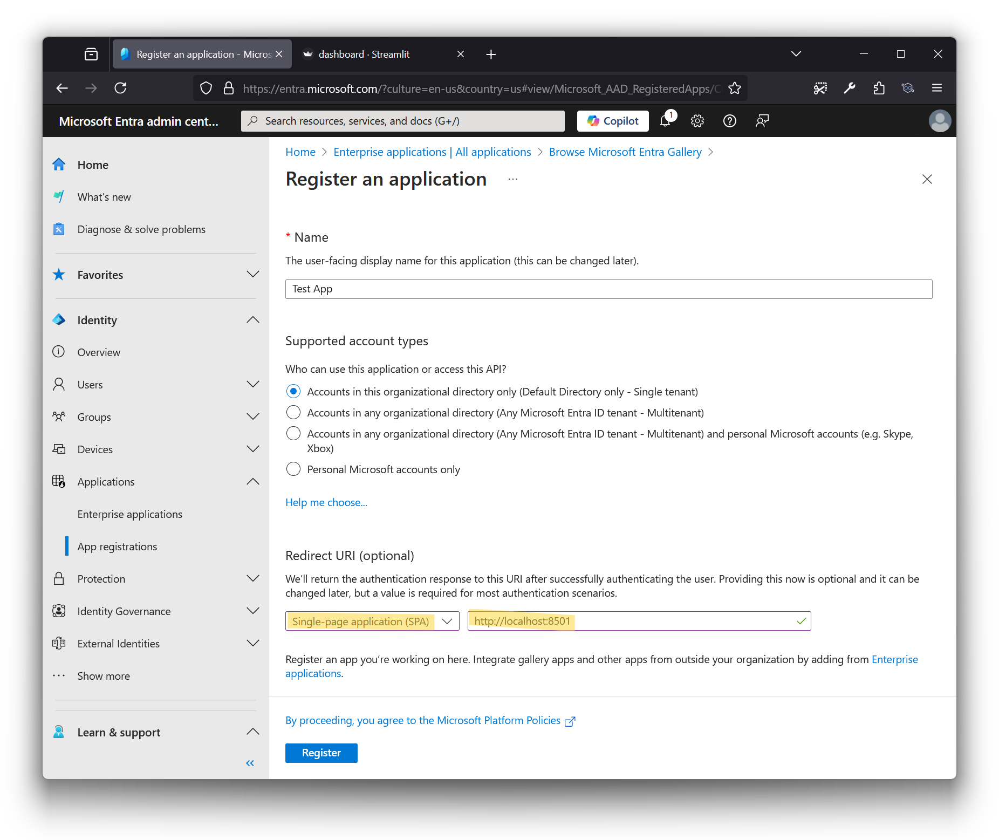
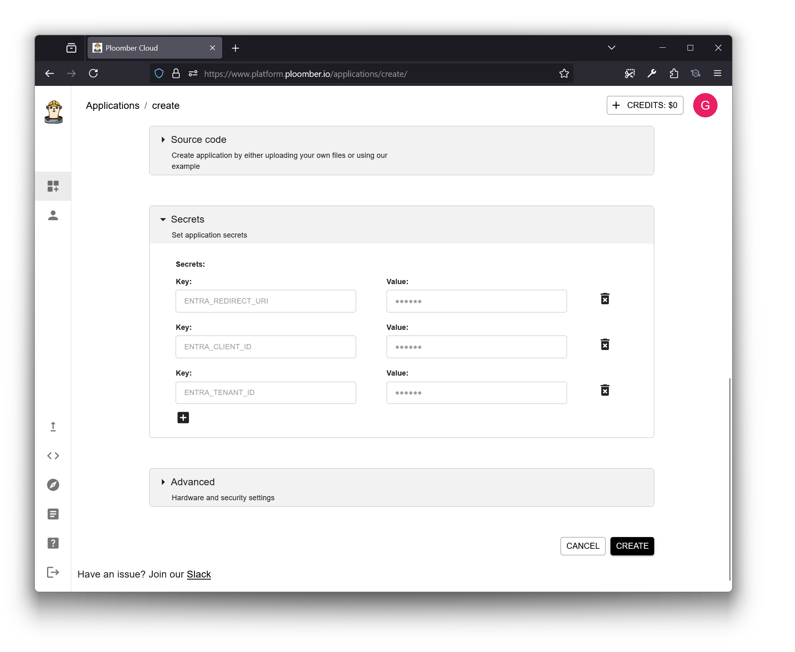

# Deploy Streamlit with MSAL Protection on Ploomber

This guide walks you through protecting your Streamlit application with Microsoft Authentication Library (MSAL) using Ploomber deployment.

## Prerequisites
- An active Azure/Microsoft Entra ID account
- A Ploomber Cloud account

## Step 1: Configure Azure/Microsoft Entra ID

1. Register a new Single Page Application in [Microsoft Entra ID](https://docs.microsoft.com/en-us/azure/active-directory/develop/scenario-spa-app-registration)
2. During registration:
   - For your callback URI, enter your domain or your Ploomber URL (e.g., `https://entra-demo.ploomber.app`. See 2. to know more about Ploomber URL)

<div align="center">
  
</div>

## Step 2: Deploy on Ploomber Cloud

1. Navigate to [Ploomber Cloud Platform](https://www.platform.ploomber.io/applications/create)
2. Click "New" to create a new deployment
3. Configure the following:
   - Upload this folder as a Zip, and choose the Streamlit Deployment
   - Application Name: Match the name entered in Entra ID so your URL match
   - If no name is provided, a random one will be assigned
    - You'll need to deploy once to get your domain in this case, then redeploy after completing all steps
4. Add the following secrets in the secrets section as shown bellow:
   ```
   ENTRA_CLIENT_ID=<Your Client ID>
   ENTRA_TENANT_ID=<Your Tenant ID>
   ENTRA_REDIRECT_URI=https://entra-demo.ploomber.app
   ```

<div align="center">
  
</div>

> [!TIP]
> **Ploomber supports custom domains & subdomains**: you can bring your own and set it up in the 
> application settings after the first deployment. If you choose to do so, instead of `https://entra-demo.ploomber.app`, 
> enter your custom domain.

## Step 3: Deploy and Verify

1. Click "CREATE" to deploy your application
2. Once the URL is up, navigate to your app, and it will be protected

<div align="center">
  
</div>

## Ressources:

- [Ploomber Documentation](https://docs.cloud.ploomber.io/en/latest/intro.html)
- [Ploomber Community](https://ploomber.io/community/)

## Local Development Setup

1. Install the required package:
   ```bash
   pip install python-dotenv
   ```

2. Load environment variables at the beginning of your file:
   ```python
   from dotenv import load_dotenv
   load_dotenv()
   ```

> [!IMPORTANT]
> Don't forget to add your `.env` to your `.gitignore`
